<div align="center">

# Yomu

Paste Japanese, see each word read, spelled and explained

[![Live][badge-site]][url-site]
[![HTML5][badge-html]][url-html]
[![CSS3][badge-css]][url-css]
[![JavaScript][badge-js]][url-js]
[![Claude Code][badge-claude]][url-claude]
[![License][badge-license]](LICENSE)

[badge-site]:    https://img.shields.io/badge/live_site-0063e5?style=for-the-badge&logo=googlechrome&logoColor=white
[badge-html]:    https://img.shields.io/badge/HTML5-E34F26?style=for-the-badge&logo=html5&logoColor=white
[badge-css]:     https://img.shields.io/badge/CSS3-1572B6?style=for-the-badge&logo=css3&logoColor=white
[badge-js]:      https://img.shields.io/badge/JavaScript-F7DF1E?style=for-the-badge&logo=javascript&logoColor=black
[badge-claude]:  https://img.shields.io/badge/Claude_Code-CC785C?style=for-the-badge&logo=anthropic&logoColor=white
[badge-license]: https://img.shields.io/badge/license-MIT-404040?style=for-the-badge

[url-site]:   https://yomu.neorgon.com/
[url-html]:   #
[url-css]:    #
[url-js]:     #
[url-claude]: https://claude.ai/code

</div>

---

## Overview

Paste a line of Japanese you met (a sign, a lyric, a chat message, a textbook
sentence) and Yomu splits it into words, puts the reading over every kanji,
writes how each word is said and how it is spelled, and explains the sounds
that are not read the way they are written: は as wa, さようなら as sayoonara,
small っ, whispered vowels. Everything runs in the browser from a committed
dictionary; your text never leaves the page unless you press a translate link.
Signing in is optional: with a Neorgon account, your kanji, saved phrases,
scores and display choices follow you to every device; without one, they stay
in this browser.

**Live:** yomu.neorgon.com

---

## Features

- **Word by word** -- a dictionary lattice over JMdict splits the text, undoes conjugations (食べました is 食べる, polite past) and reads numbers with their counters (3時, 十分)
- **Two romaji lines** -- *said* in Genki's convention (sayoonara, sensee, watashi wa) and *spelled* kana by kana (sa-yo-u-na-ra), so the difference is the lesson
- **Special sounds, explained** -- particle は/へ/を, long vowels, small っ, youon, voicing marks, ん before m/b/p, whispered vowels, each with one rule, examples and a minimal pair
- **Grammar in the text** -- particles, です and ます forms, te-forms, conditionals (ば, たら, なら, と), each named where it occurs
- **Kanji table** -- every kanji in the text with its reading here, meaning, on and kun readings and parts; hover or tap a row to find it in the text, and the other way round
- **My kanji** -- save kanji for a short daily review, and collect every kanji you read on shelves of the 2,136 jōyō kanji by school grade, each with where you last met it
- **History, if you want it** -- turn on Remember and Yomu keeps the texts you read in this browser, tells you when you read one before, and shows the sentence each kanji was last seen in
- **Saved phrases** -- the bookmark beside Clear keeps a text on purpose, whatever Remember says: it stays in History until you unsave it, still counts when you read it again, and goes into My kanji's backup
- **Play** -- four short games with the characters that look alike: pick the kana or kanji among its look-alikes, find the odd one in a grid (timed or not), tell カ from 力 by the word around it, and decode katakana names to Tom and Mary; the pairs you mix up come round more often
- **Translation on the page** -- in Chrome or Edge on a computer, the browser's own on-device translator writes the translation under the reading, after one click; the text never leaves the device. Elsewhere, DeepL and Google Translate open in a new tab
- **Sound it out** -- a word's beats one at a time, then the whole word, spoken with the device's Japanese voice
- **Phrases** -- 71 everyday phrases and 8 short dialogues written for Yomu, with set phrases to practise as chunks
- **Embeddable** -- Runcible opens Yomu in a side sheet when a phrase in a chapter is tapped (`docs/EMBED.md`)
- **On every device, if you sign in** -- one Neorgon account syncs My kanji, saved phrases, Play's scores and the display choices through Convex; an unsave or Clear all reaches the other devices too, and the text in the box and History's unsaved texts never leave this browser

---

## Running locally

ES modules require an HTTP server (not `file://`):

```bash
make serve       # http://localhost:8895
make validate    # tools/check-data.mjs, then npm test
make data        # rebuild data/dict and data/kanji from the pinned upstreams (manual step)
npx convex dev --once   # push convex/ to the dev deployment (convex/README.md)
```

Sign-in uses the fleet's production Clerk key, which refuses localhost: the
dialog says so. The sync logic is tested under node against the real server
functions (`npm test`), and the functions against the dev deployment with
`npx convex run --identity`.

---

## Architecture



```
yomu-site/
├── index.html            # the page: text box, reading, side column, phrases dialog
├── css/style.css         # the reader's styles (tokens come from the fleet CDN)
├── js/
│   ├── app.js            # entry point
│   ├── kana.js           # beats, the said and spelled romaji, devoicing
│   ├── dict.js           # loads only the dictionary shards a text needs
│   ├── deinflect.js      # conjugation rules, written for Yomu
│   ├── lattice.js        # the cheapest path through the candidate words
│   ├── costs.js          # word and connection costs for the lattice
│   ├── numbers.js        # numerals and counters with their sound changes
│   ├── names.js          # a reading guess for kanji runs the dictionary lacks
│   ├── sounds-like.js    # the English a katakana part no record covers sounds like, as a guess
│   ├── furigana.js       # which part of a reading belongs to which kanji
│   ├── analyze.js        # text in, tokens and kanji list out
│   ├── sounds.js         # special-sound detection
│   ├── grammar.js        # particle, copula and ending annotations
│   ├── notes*.js         # every explanation, in English and Spanish
│   ├── reader.js         # the page's seam to the analyzer
│   ├── render*.js        # the reading, word panel, kanji table, notes, phrases
│   ├── events.js         # input, selection, hover and tap, speech
│   ├── speech.js         # speechSynthesis with a Japanese voice
│   ├── play-*.js         # Play: the rounds, the store, the clock, the kana sets and twins (no DOM)
│   ├── events-play.js    # Play's routes, keys and actions (Odd one out's clock: events-odd.js)
│   ├── account.js        # sign-in (Neorgon Auth Kit) and when to sync; loaded only with a Clerk key, never in an embed
│   ├── sync*.js          # sync: the merge rules (shared with convex/), the plan, the client, the book
│   └── embed.js          # the yomu-embed/1 protocol
├── data/
│   ├── dict/             # JMdict: a core, 28 range shards and a key filter, each under 140 KB
│   ├── kanji/            # KANJIDIC and KanjiVG parts, and joyo.json (the jōyō list by grade)
│   ├── like/             # English words JMdict glosses with, for the sound-alike guess
│   ├── play/             # the kanji look-alikes, built from data/kanji by tools/build-lookalikes.mjs
│   └── phrases/          # the phrase library (original, CC0)
├── convex/               # the Convex backend: schema, auth config, sync functions (only signed-in data)
├── tools/                # hand-run builders and the data checker
├── tests/                # node:test suites and a render harness
└── docs/                 # ANALYZER.md (the contract), EMBED.md (the protocol)
```

Dictionary data: JMdict and KANJIDIC by the Electronic Dictionary Research and
Development Group (CC BY-SA 4.0), KanjiVG by Ulrich Apel (CC BY-SA 3.0),
Tatoeba (CC BY 2.0 FR, word ranking only).

---

<div align="center">
<sub>Part of <a href="https://neorgon.com/">Neorgon</a></sub>
</div>
